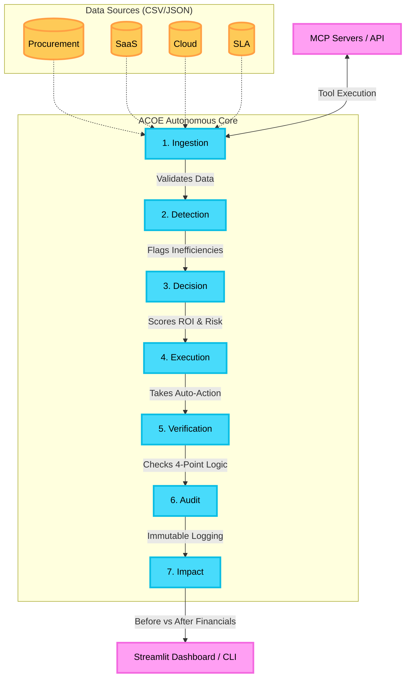

# 🤖 ACOE — Autonomous Cost Optimization Engine

> **A fully autonomous AI system that detects enterprise cost inefficiencies, makes decisions, and executes optimizations — with zero human intervention.**

---

## 📌 Table of Contents

1. [Project Overview](#-project-overview)
2. [Architecture & Tech Stack](#-architecture--tech-stack)
3. [7-Stage Autonomous Pipeline](#-7-stage-autonomous-pipeline)
4. [Quick Start (Judge Demo)](#-quick-start-judge-demo)
5. [File Structure](#-file-structure)
6. [Key Files to Edit](#-key-files-to-edit)
7. [Uploading Your Own Data Files](#-uploading-your-own-data-files)
8. [Changing Demo Data](#-changing-demo-data)
9. [Configuration Reference](#-configuration-reference)
10. [Running the Dashboard](#-running-the-dashboard)
11. [Running the CLI Demo](#-running-the-cli-demo)
12. [Troubleshooting](#-troubleshooting)

---

## 🏆 Project Overview

**ACOE** (Autonomous Cost Optimization Engine) is a multi-agent AI system designed to autonomously:

- **Detect** cost inefficiencies across procurement, SaaS, cloud, and SLA compliance
- **Decide** the optimal corrective action using confidence scoring, ROI analysis, and risk assessment
- **Execute** the actions autonomously (cancel subscriptions, renegotiate contracts, reallocate compute)
- **Verify** every outcome with a 4-point check
- **Audit** every decision in a full immutable log
- **Report** the financial impact in INR (Before vs. After)

No manual approval. No human-in-the-loop. **Fully autonomous.**

---

## 🏗️ Architecture & Tech Stack

### System Architecture & Workflow Diagram



### Tech Stack

| Layer | Technology |
|---|---|
| **Language** | Python 3.10+ |
| **Dashboard** | Streamlit |
| **API** | FastAPI + Uvicorn |
| **Data** | Pandas, NumPy |
| **ML / Anomaly** | Scikit-learn (z-score) |
| **Config** | YAML (config.yaml) |
| **Containerization** | Docker + Docker Compose |

---

## 🔄 7-Stage Autonomous Pipeline

```
Stage 1: INGESTION   → Loads CSV/JSON enterprise data (procurement, SaaS, cloud, SLA)
Stage 2: DETECTION   → Identifies inefficiencies via rule-based heuristics + z-score anomaly detection
Stage 3: DECISION    → Generates action plans with confidence, risk, and ROI scoring
Stage 4: EXECUTION   → Executes corrective actions autonomously (with retry logic)
Stage 5: VERIFICATION→ 4-point outcome verification (status + message + entity + deviation)
Stage 6: AUDIT       → Logs every decision, action, and result to immutable audit trail
Stage 7: IMPACT      → Computes realized savings, projected annual savings, avoided penalties
```

**Result:** A clear **BEFORE vs. AFTER** financial comparison with INR savings.

---

## ⚡ Quick Start (Judge Demo)

### Prerequisites

```bash
# Ensure Python 3.10+ is installed
python --version

# Install dependencies
pip install -r requirements.txt
```

### Option 1: Terminal Demo (Fastest — Recommended for Judges)

```bash
# Navigate to the ACOE directory
cd "c:\Users\nasim\OneDrive\Desktop\AI projects\Autonomous automation\ACOE"

# Run the full 7-stage autonomous demo
python run_acoe.py
```

This will:
1. Initialize all 7 agents
2. Display BEFORE state (current enterprise spend)
3. Execute all 7 pipeline stages in sequence
4. Print AFTER state with exact INR savings
5. Continue running autonomously (press `Ctrl+C` to stop)

### Option 2: Web Dashboard (Visual Interface)

```bash
# Navigate to the ACOE directory
cd "c:\Users\nasim\OneDrive\Desktop\AI projects\Autonomous automation\ACOE"

# Launch the Streamlit dashboard
streamlit run dashboard/app.py
```

Then open your browser at: **http://localhost:8501**

### Option 3: Quick Demo Script

```bash
python demo.py
```

Runs a single pipeline cycle and prints a clean tabular BEFORE vs. AFTER report.

---

## 📁 File Structure

```
ACOE/
│
├── 📋 README.md                   # This file
├── ⚙️  config.yaml                # Main configuration (thresholds, intervals, modes)
├── ⚙️  config.py                  # Config loader and constants
├── 📦 requirements.txt            # Python dependencies
│
├── 🚀 run_acoe.py                 # ★ MAIN ENTRY POINT — Full judge demo with autonomous loop
├── 🎯 demo.py                     # Quick single-cycle demo (tabular output)
├── 🔁 run_demo.py                 # Alternate demo runner
├── 🌐 main.py                     # FastAPI app entry point
│
├── agents/                        # ★ CORE: 7 autonomous AI agents
│   ├── __init__.py
│   ├── ingestion.py               # Stage 1: Loads and parses data files
│   ├── detection.py               # Stage 2: Anomaly detection + rule engine
│   ├── decision.py                # Stage 3: Action planning with scoring
│   ├── execution.py               # Stage 4: Executes actions with retry
│   ├── verification.py            # Stage 5: 4-point outcome verification
│   ├── audit.py                   # Stage 6: Immutable audit log writer
│   └── impact.py                  # Stage 7: Financial impact calculator
│
├── data/                          # ★ DEMO DATA — Edit these CSVs to change input
│   ├── procurement.csv            # Procurement contracts (15 records)
│   ├── saas_subscriptions.csv     # SaaS subscriptions (18 records)
│   ├── cloud_usage.csv            # Cloud resource usage (15 records)
│   └── sla_metrics.csv            # SLA performance metrics (15 records)
│
├── dashboard/
│   └── app.py                     # ★ STREAMLIT UI — Neo-brutalist visual dashboard
│
├── models/
│   └── schemas.py                 # Pydantic data models (ProcurementRecord, etc.)
│
├── api/                           # FastAPI REST endpoints
├── orchestrator/                  # Pipeline orchestration utilities
├── state/                         # SQLite state management
├── logs/                          # Audit logs (auto-generated)
│
├── config.yaml                    # ★ EDIT THIS to change thresholds/behavior
├── Dockerfile                     # Docker build file
├── docker-compose.yml             # Docker Compose (ACOE + API together)
│
├── mcp_servers/                   # ★ MCP SERVERS — AI-callable tool endpoints
│   ├── __init__.py
│   ├── base.py                    # JSON-RPC 2.0 server framework
│   ├── utils.py                   # Shared utilities
│   ├── pipeline_server.py         # Pipeline tools (8 tools)
│   ├── data_server.py             # Data CRUD tools (5 tools)
│   ├── config_server.py           # Config tools (4 tools)
│   ├── monitoring_server.py       # Monitoring tools (6 tools)
│   └── launcher.py                # Unified launcher + test suite
│
└── mcp_config.json                # MCP client configuration file
```

---

## ✏️ Key Files to Edit

### 1. `config.yaml` — System Behavior & Thresholds

> **Edit this file to change how aggressively the engine detects and acts.**

```yaml
# config.yaml — key settings

thresholds:
  saas_utilization_pct: 40        # Flag SaaS if active_users/total_licenses < 40%
  cloud_utilization_pct: 35       # Flag cloud resource if avg_usage < 35% of capacity
  sla_breach_window_hours: 48     # Flag SLA if breach deadline is within 48 hours
  anomaly_z_score: 2.0            # Flag spend as anomalous if z-score > 2.0

decision:
  min_confidence: 0.60            # Only act if AI confidence score >= 60%
  max_risk: 0.70                  # Block action if risk score > 70%
  roi_threshold: 1.5              # Only recommend if ROI >= 1.5x

scheduler:
  interval_seconds: 60            # How often the autonomous loop re-runs (seconds)
```

### 2. `data/*.csv` — Demo Input Data

> **Edit these CSVs to change what inefficiencies the engine detects.**

See the [Changing Demo Data](#-changing-demo-data) section below.

### 3. `dashboard/app.py` — Visual Dashboard

> **Edit lines 36–48 to change colors; lines 604+ to modify UI sections.**

```python
# Line 36–41 — Change the color palette:
ACCENT = "#50C878"    # Primary green — change this for a different brand color
BLACK  = "#1E211E"    # Background dark color
WHITE  = "#FFF5EE"    # Light background (Seashell Cream)
```

### 4. `run_acoe.py` — CLI Demo Script

> **Edit the startup banner message (lines 154–165) for customization.**
> **The `LOOP_INTERVAL_SECONDS` in config controls how fast the loop cycles.**

---

## 📤 Uploading Your Own Data Files

### Via the Web Dashboard (Easiest)

1. Launch the dashboard: `streamlit run dashboard/app.py`
2. Open **http://localhost:8501** in your browser
3. In the **left sidebar**, scroll to the **"📁 Upload Data Files"** section
4. Upload files for any of the 4 categories:
   - **Procurement CSV** — your contract data
   - **SaaS Subscriptions CSV** — your software subscription data
   - **Cloud Usage CSV** — your cloud resource data
   - **SLA Metrics CSV** — your SLA performance data
5. Supported formats: **CSV**, **JSON**, **Excel (.xlsx)**
6. Click **"RUN OPTIMIZATION"** — the engine uses your uploaded files instead of demo data

> **Important:** Your uploaded file must have the same column headers as the default CSV files. See the column reference below.

### Required Column Headers

**`procurement.csv`**
```
record_id, vendor_name, service_category, contract_value_inr,
contract_start, contract_end, department, payment_frequency, description
```

**`saas_subscriptions.csv`**
```
subscription_id, vendor_name, product_name, total_licenses,
active_users, monthly_cost_inr, plan_tier, renewal_date, department
```

**`cloud_usage.csv`**
```
resource_id, provider, resource_type, region, capacity_units,
avg_usage_units, peak_usage_units, monthly_cost_inr, department
```

**`sla_metrics.csv`**
```
sla_id, service_name, vendor_name, metric_name, target_value,
current_value, measurement_unit, breach_penalty_inr,
measurement_timestamp, breach_deadline
```

### Date Format
All date fields must use `YYYY-MM-DD` format, e.g. `2025-12-31`

---

## 🔧 Changing Demo Data

The demo data lives in the `data/` directory. You can edit these CSV files directly to change what the engine detects.

### To change a vendor / add a SaaS subscription:

Open `data/saas_subscriptions.csv` and add or edit a row:

```csv
# Add a new row at the bottom of the file
# Format: subscription_id, vendor_name, product_name, total_licenses, active_users, monthly_cost_inr, plan_tier, renewal_date, department

SAAS-019,Slack Technologies,Slack Pro,300,45,225000,pro,2025-11-30,Engineering
# ↑ Only 45/300 users active = 15% utilization → WILL be flagged as wasteful
```

### To simulate a cloud over-provisioning issue:

Open `data/cloud_usage.csv` and add a row where `avg_usage_units` is very low vs `capacity_units`:

```csv
# Format: resource_id, provider, resource_type, region, capacity_units, avg_usage_units, peak_usage_units, monthly_cost_inr, department

CLOUD-016,AWS,EC2 Compute,ap-south-1,1000,100,200,950000,Marketing
# ↑ 100/1000 = 10% utilization → CRITICAL over-provisioning flagged
```

### To trigger a critical SLA breach:

Open `data/sla_metrics.csv` and set `current_value` below `target_value`:

```csv
# Format: sla_id, service_name, vendor_name, metric_name, target_value, current_value, measurement_unit, breach_penalty_inr, measurement_timestamp, breach_deadline

SLA-016,Core API,CloudNine,uptime_pct,99.9,97.5,percent,5000000,2025-03-28T00:00:00,2025-03-29T00:00:00
# ↑ 97.5% actual vs 99.9% target → BREACH with ₹50L penalty
```

### After editing, re-run the demo:

```bash
python run_acoe.py
# or
streamlit run dashboard/app.py  # then click "RUN OPTIMIZATION"
```

---

## ⚙️ Configuration Reference

| Key | Default | Description |
|-----|---------|-------------|
| `system.demo_mode` | `true` | Use fixed random seed for reproducibility |
| `system.random_seed` | `42` | Seed for deterministic anomaly scoring |
| `scheduler.interval_seconds` | `60` | Autonomous loop cycle interval |
| `thresholds.saas_utilization_pct` | `40` | SaaS waste detection threshold (%) |
| `thresholds.cloud_utilization_pct` | `35` | Cloud over-provisioning threshold (%) |
| `thresholds.sla_breach_window_hours` | `48` | SLA breach urgency window (hours) |
| `thresholds.anomaly_z_score` | `2.0` | Statistical anomaly sensitivity |
| `decision.min_confidence` | `0.60` | Minimum AI confidence to execute action |
| `decision.max_risk` | `0.70` | Maximum risk score allowed for execution |
| `decision.roi_threshold` | `1.5` | Minimum ROI multiplier to approve action |
| `execution.max_retries` | `3` | Number of retry attempts on failed actions |
| `safety.max_actions_per_cycle` | `50` | Hard cap on actions per cycle |
| `safety.budget_cap_inr_per_cycle` | `10000000` | Maximum spend impact per cycle (₹1 Cr) |

---

## 🌐 Running the Dashboard

```bash
# From the ACOE directory
streamlit run dashboard/app.py
```

**Dashboard Tabs:**
| Tab | What it Shows |
|-----|--------------|
| 🚨 PROBLEM | Enterprise cost leakage overview & detected issues |
| 🔍 DETECTION | Every detected inefficiency with severity & savings potential |
| 🧠 DECISION | AI reasoning, confidence scores, ROI analysis per action |
| ⚡ EXECUTION | Execution logs, retry counts, API calls made |
| ✅ VERIFICATION | 4-point outcome verification results |
| 📊 IMPACT | Before vs. After financials, savings breakdown |
| 📋 AUDIT | Full decision audit trail |

**Sidebar Controls:**
- **RUN OPTIMIZATION** — Trigger a new pipeline cycle
- **Upload Data Files** — Replace default CSVs with your own data

---

## 💻 Running the CLI Demo

```bash
python run_acoe.py
```

**What you'll see:**
```
╔══════════════════════════════════════════════════════════════════╗
║   AUTONOMOUS COST OPTIMIZATION ENGINE (ACOE)                   ║
║   Version: 2.0.0 | Mode: FULLY AUTONOMOUS                      ║
╚══════════════════════════════════════════════════════════════════╝

STAGE 1: DATA INGESTION          ← Loads 63 records from 4 data sources
STAGE 2: DETECTING INEFFICIENCIES ← Finds N issues using z-score + rules
STAGE 3: AUTONOMOUS DECISION     ← AI plans optimized corrective actions
STAGE 4: EXECUTING ACTIONS       ← Actions executed without human approval
STAGE 5: VERIFYING OUTCOMES      ← 4-point verification of every action
STAGE 6: AUDIT TRAIL             ← Full decision chain logged
STAGE 7: FINANCIAL IMPACT        ← Realized savings computed

╔══════════════════════════════╗
║   BEFORE vs AFTER COMPARISON ║
║   SAVINGS: ₹X,XX,XX,XXX/yr  ║
╚══════════════════════════════╝
```

Press `Ctrl+C` to stop the autonomous loop.

---

## 🐳 Docker Deployment (Optional)

```bash
# Build and run with Docker Compose
docker-compose up --build

# ACOE API will be available at http://localhost:8000
# Dashboard: streamlit run dashboard/app.py (run separately)
```

---

## 🛠️ Troubleshooting

| Error | Fix |
|-------|-----|
| `ModuleNotFoundError: streamlit` | Run `pip install -r requirements.txt` |
| `ModuleNotFoundError: pandas` | Run `pip install pandas` or check your virtual env |
| `UnicodeEncodeError` on Windows | Already handled in `run_acoe.py` — run as-is |
| Dashboard shows no data | Click **"RUN OPTIMIZATION"** in the sidebar |
| CSV upload fails | Check that column headers match the required format exactly |
| Config not found warning | Normal — system uses built-in defaults |
| `Port 8501 already in use` | Kill existing Streamlit: `taskkill /f /im streamlit.exe` (Windows) |

---

## 📊 Expected Demo Output (Sample)

```
BEFORE State:
  Procurement Contracts   ₹1,77,00,000/month   ₹21,24,00,000/year
  SaaS Subscriptions      ₹29,77,500/month      ₹3,57,30,000/year
  Cloud Infrastructure    ₹57,85,000/month      ₹6,94,20,000/year
  TOTAL SPEND             ₹2,64,62,500/month    ₹31,75,50,000/year

AFTER Optimization:
  TOTAL SAVINGS           ₹X,XX,XX,XXX/year
  COST REDUCTION:         XX.X%
  HUMAN INTERVENTION:     NONE — Fully Autonomous
```

---

## 🔌 MCP Servers (Model Context Protocol)

ACOE includes **4 MCP servers** that expose the entire system as AI-callable tools. Any MCP-compatible AI assistant can autonomously run pipeline stages, manage data, adjust configuration, and query analytics.

### Quick Start

```bash
# List all available servers
python mcp_servers/launcher.py

# Run self-tests on all servers (verify everything works)
python mcp_servers/launcher.py --test

# Start a specific server
python mcp_servers/launcher.py pipeline      # 7-stage pipeline tools
python mcp_servers/launcher.py data          # Data CRUD tools
python mcp_servers/launcher.py config        # Config management tools
python mcp_servers/launcher.py monitoring    # Analytics & monitoring tools
```

### Server Architecture

| Server | Tools | Description |
|--------|-------|-------------|
| **acoe-pipeline** | 8 | Run each of the 7 pipeline stages individually or all at once |
| **acoe-data** | 5 | CRUD operations on procurement/SaaS/cloud/SLA CSV data |
| **acoe-config** | 4 | Read/update `config.yaml` settings dynamically |
| **acoe-monitoring** | 6 | System status, audit logs, metrics, simulation, predictions |

### Tool Reference

#### Pipeline Server (8 tools)

| Tool | Description |
|------|-------------|
| `acoe_ingest` | Stage 1: Load & validate enterprise data from CSV sources |
| `acoe_detect` | Stage 2: Detect cost inefficiencies using rules + z-score |
| `acoe_decide` | Stage 3: Generate action plans with ROI/risk scoring |
| `acoe_execute` | Stage 4: Execute actions autonomously with retry logic |
| `acoe_verify` | Stage 5: 4-point outcome verification |
| `acoe_audit` | Stage 6: Write immutable audit trail |
| `acoe_impact` | Stage 7: Compute financial impact report (Before vs After) |
| `acoe_run_full_cycle` | Run all 7 stages end-to-end in one call |
------
#### Data Server (5 tools)

| Tool | Description |
|------|-------------|
| `data_list_sources` | List all data files with record counts and schemas |
| `data_read_source` | Read records from a specific source (procurement/saas/cloud/sla) |
| `data_add_record` | Add a new record to a CSV data source |
| `data_update_record` | Update an existing record by ID |
| `data_get_summary` | Get aggregate statistics and spend totals across all sources |

#### Config Server (4 tools)

| Tool | Description |
|------|-------------|
| `config_get_all` | Get the complete current configuration |
| `config_get_value` | Get a specific config value by dot notation (e.g. `thresholds.saas_utilization_pct`) |
| `config_set_value` | Update a config value dynamically at runtime |
| `config_reset` | Reload configuration from `config.yaml` |

#### Monitoring Server (6 tools)

| Tool | Description |
|------|-------------|
| `monitor_system_status` | Get system health, data files, cycle count |
| `monitor_get_audit_logs` | Retrieve recent audit trail entries |
| `monitor_get_metrics` | Get aggregate performance metrics |
| `analytics_simulate` | Run what-if scenarios (aggressive/conservative/balanced) |
| `analytics_predict_savings` | Forecast future savings trends |
| `analytics_predict_risks` | Analyze SLA breach risks and cost leak exposure |

### Integration with AI Assistants

Use the provided `mcp_config.json` to connect AI assistants:

```json
{
  "mcpServers": {
    "acoe-pipeline": {
      "command": "python",
      "args": ["mcp_servers/pipeline_server.py"],
      "cwd": "/path/to/ACOE"
    }
  }
}
```

### MCP Server Files

```
mcp_servers/
├── __init__.py              # Package init
├── base.py                  # MCP base server framework (JSON-RPC 2.0 over stdio)
├── utils.py                 # Shared utilities (serialization, CSV I/O, validation)
├── pipeline_server.py       # Pipeline MCP server (8 tools)
├── data_server.py           # Data management MCP server (5 tools)
├── config_server.py         # Config management MCP server (4 tools)
├── monitoring_server.py     # Monitoring & analytics MCP server (6 tools)
└── launcher.py              # Unified launcher with self-test suite
```

---

## 👥 Team

Built for the **Autonomous AI Hackathon** — demonstrating how AI agents can autonomously manage enterprise financial operations with zero human intervention.

---

## 📜 License

MIT — Free to use, modify, and distribute.
