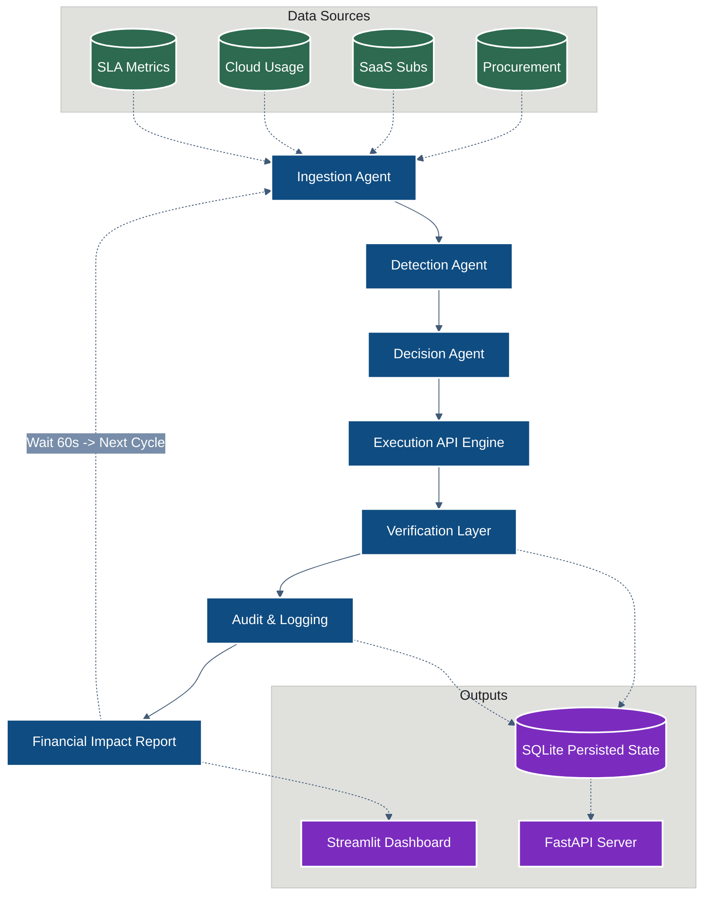

# ACOE — Autonomous Cost Optimization Engine

<div align="center">
  
  
  
  
  <br>
  <em>A fully autonomous, self-running, production-grade multi-agent system that continuously detects enterprise cost inefficiencies, decides optimal actions, executes them, and reports quantified financial impact.</em>
</div>

---

## 🏗️ Architecture & Core Workflow

The system is built on an idempotent, self-healing **7-stage multi-agent pipeline**. It autonomously evaluates corporate data environments (cloud, SaaS, procurement contracts) at a regular cadence, executing fixes strictly driven by dynamic Return on Investment (ROI) and heuristic rulesets.

### Execution Lifecycle



---

## 📂 Project Details: File Structure & Components

The **ACOE** platform acts as a unified orchestrator overseeing granular agent modules, configuration centers, and API layers to manage cost-recovery operations seamlessly without human mediation.

| Directory / File | Description & Usage |
| :--- | :--- |
| `run_acoe.py` | ⚡ **Unified Judge-Ready Demonstration Entry Point**. Runs an immediate, colorized 7-stage pipeline outputting a visual `BEFORE vs AFTER` terminal comparison before falling back to the autonomous background loop. |
| `main.py` | ⚙️ **Standard Daemon Entry Point**. Starts the unified background process, attaching the internal scheduler to run agents without the dramatic CLI visualization output. |
| `process_manager.py` | **Core Supervisor**. Establishes the `FastAPI` server simultaneously, configures structured logging, sets up exponential backoff schedulers, and connects circuit breakers. |
| `state_manager.py` | **SQLite Data Abstraction**. Safely maintains records of execution logs, duplicate/idempotency guarantees (so an action isn't run twice), metrics, and impact reports across restarts. |
| `metrics.py` & `safety.py`| **Observability Constraints**. Hard constraints mapping boundary conditions that the agents cannot break (e.g. `maximum INR spending limit`, `critical protected infrastructure domains`). |
| `circuit_breaker.py` | **Fault Isolation Model**. Handles external failures safely. If mock endpoints begin blocking connections, the orchestrator backs down automatically protecting loop continuity. |
| `config.yaml` | **Configuration**. Primary driver for algorithmic thresholds like `z-score` limits, cycle intervals (in seconds), and budget ceilings. |
| `dashboard/app.py` | **Visual UI Application**. A Streamlit frontend dashboard giving real-time visibility into cost recoveries, graphs, and current system cycles via terminal `localhost:8501`. |
| `api/server.py` | **REST Integrations**. Exposes programmatic inspection paths covering `/status`, `/ingest`, `/analyze`, `/act`, and direct `/report` access locally on port `8000`. |
| `data/` | **Synthetic Environments**. Holds mock, deterministic representations of enterprise environments containing bloated SaaS licenses and idle Cloud clusters. |

### 🤖 The Agent Modules (`agents/`)

Each file inside the `agents/` directory functions as an autonomous microservice handling a singular execution logic step within the loop.
- **`ingestion.py`**: Normalizes local CSV inputs into schema models strictly enforced by `Pydantic`.
- **`detection.py`**: Evaluates active arrays to trigger heuristic threshold breaks and variance standard deviations (z-scores outliers) to formulate "Anomalies".
- **`decision.py`**: Risk vs Reward logic engine. Assigns algorithmic ROI tags and decides which simulated API execution script must run.
- **`execution.py`**: The "Actuator". Performs simulated `POST`, `PATCH`, `DELETE` events handling retries internally with backing-off techniques.
- **`verification.py`**: A cross-check validator guaranteeing the execution output corresponds actively with the newly ingested state values.
- **`audit.py`**: Injects an immutable trace back to the SQLite ledger defending *why* a decision passed execution.
- **`impact.py`**: Compiles string-aggregated financial values (`INR`) showcasing exactly how much active runway usage was saved explicitly.

---

## 🚀 Step-by-Step Running Guide (Error-Free)

**Prerequisites**: Python `3.9` or higher natively installed. You do not need any external databases or cache servers, as the platform wraps an SQLite implementation entirely within itself.

### Step 1: Install Python Dependencies
Open your preferred terminal, navigate inside the foundational `ACOE/` root directory and pull via pip.
```bash
pip install -r requirements.txt
```

### Step 2: Run the Demonstration Layer (Highly Recommended)
We recommend launching the overarching `run_acoe.py` script. The demonstration mode immediately analyzes the mock CSV environments, maps errors, prints out an incredibly clean `BEFORE vs AFTER` cost assessment in your terminal, and smoothly slides into standard continuous loop mode.

```bash
python run_acoe.py
```
> [!NOTE] 
> No human input or confirmation is required at any time. The process will ingest, analyze, fix, and report anomalies automatically out of the box. Output is visually color-coded dynamically. To exit cleanly, press `Ctrl+C`.

### Step 3: Launch Observability Visualizations (Optional)
If you wish to view graphs and cost assessments while the CLI script runs natively in the background, open a **separate concurrent terminal** tab and trigger the dashboard.
```bash
streamlit run dashboard/app.py
```
*(Available locally at `http://localhost:8501`).*

---

### Alternative: Standard Daemon Configuration
If deploying towards a VM environment, or running unattended without needing the visual console interface, run the core main script directly:

```bash
python main.py
```

While running, interact with the platform programmatically through standard `Swagger UI` integration at `http://localhost:8000/docs`. By default, the system reschedules iterations every 60 seconds unless overriden via `config.yaml`.
